 

<h3>
  <em>Curious by nature. Disciplined by practice. Building AI-powered software that ships.</em>
</h3>

 

·&nbsp; &nbsp; **Computer Science Engineering (CS · IoT)** &nbsp; · &nbsp; **Poornima Institute of Engineering & Technology** &nbsp; ·

 
 

## About

I'm **Prince Naruka**, a B.Tech Computer Science (IoT) student learning by building real, working software — not tutorials.

My focus is on **AI-powered systems**: agents, retrieval pipelines, and the full-stack infrastructure that turns a model into a product. I care about code that is production-ready, not just demo-ready.

> I learn by shipping. I improve by iterating. I build for the long run.

 

## Focus Areas

<table>
<tr>
<td valign="top" width="50%">

**Artificial Intelligence**
- Large Language Models (LLMs)
- AI Agents
- Retrieval-Augmented Generation (RAG)

</td>
<td valign="top" width="50%">

**Engineering**
- Full-Stack Development
- Automation
- Developer Tools · Cloud Technologies

</td>
</tr>
</table>

 

## Currently Building

<table>
<tr>
<td width="70%">

**College Council Event Management System**
 End-to-end platform for managing college council events and operations.

</td>
<td align="right" width="30%">Active</td>
</tr>
<tr><td colspan="2">
</td></tr>
<tr>
<td width="70%">

**AI Command Center**
 A unified control surface for orchestrating AI agents and workflows.

</td>
<td align="right" width="30%">Active</td>
</tr>
<tr><td colspan="2">
</td></tr>
<tr>
<td width="70%">

**Personal AI Assistant**
 A private assistant built around agents, memory, and retrieval.

</td>
<td align="right" width="30%">Active</td>
</tr>
<tr><td colspan="2">
</td></tr>
<tr>
<td width="70%">

**AI-Powered Productivity Tools**
 Small, focused tools that remove friction from everyday workflows.

</td>
<td align="right" width="30%">Active</td>
</tr>
</table>

 

## Tech Stack

<table>
<tr>
<td valign="top" width="20%">

**Languages**
 
Python 
Java 
C 
JavaScript 
TypeScript

</td>
<td valign="top" width="20%">

**Frontend**
 
React 
Next.js 
HTML · CSS 
Tailwind CSS

</td>
<td valign="top" width="20%">

**Backend**
 
Node.js 
Express.js 
Prisma

</td>
<td valign="top" width="20%">

**Data**
 
PostgreSQL 
SQLite 
Supabase

</td>
<td valign="top" width="20%">

**AI**
 
OpenAI API 
Ollama 
LangGraph 
MCP · RAG

</td>
</tr>
<tr>
<td valign="top" colspan="2">

**Cloud & DevOps**
 
Docker · Git · GitHub · AWS · Azure

</td>
<td valign="top" colspan="3">

**Tools**
 
VS Code · Postman · Figma

</td>
</tr>
</table>

 

## Currently Learning

AI Agents &nbsp;·&nbsp; LangGraph &nbsp;·&nbsp; MCP &nbsp;·&nbsp; RAG Evaluation &nbsp;·&nbsp; Docker &nbsp;·&nbsp; CI/CD &nbsp;·&nbsp; Cloud Deployment &nbsp;·&nbsp; System Design &nbsp;·&nbsp; Data Structures & Algorithms

 
 

## Approach

<table>
<tr><td>01</td><td>Learn by building</td></tr>
<tr><td>02</td><td>Solve real problems</td></tr>
<tr><td>03</td><td>Write maintainable code</td></tr>
<tr><td>04</td><td>Quality over quantity</td></tr>
<tr><td>05</td><td>Keep improving through iteration</td></tr>
</table>

 

## Goals

Build impactful AI products &nbsp;·&nbsp; Contribute to open source &nbsp;·&nbsp; Become an AI Engineer &nbsp;·&nbsp; Build scalable systems &nbsp;·&nbsp; Continuously learn

 
 

## Featured Projects

<table>
<tr>
<td width="100%">

**College Council Event Management System**
 A platform to manage college council events, registrations, and operations end-to-end.
  
**Stack:** _add technologies used_
 
🔗 Repository: `github.com/PrinceNaruka/<repo-name>` &nbsp;·&nbsp; Live demo: _add link if available_

</td>
</tr>
<tr><td>
</td></tr>
<tr>
<td width="100%">

**AI Command Center**
 A control surface for orchestrating AI agents, tools, and workflows from one place.
  
**Stack:** _add technologies used_
 
🔗 Repository: `github.com/PrinceNaruka/<repo-name>` &nbsp;·&nbsp; Live demo: _add link if available_

</td>
</tr>
<tr><td>
</td></tr>
<tr>
<td width="100%">

**Personal AI Assistant**
 An agent-driven assistant with memory and retrieval, built for real daily use.
  
**Stack:** _add technologies used_
 
🔗 Repository: `github.com/PrinceNaruka/<repo-name>` &nbsp;·&nbsp; Live demo: _add link if available_

</td>
</tr>
</table>

 

## Connect

 

Designed with intention. Built to last.

