<!--
  Prince Naruka — profile.
  Repo: princeji2/princeji2

  Three self-contained animated SVGs (assets/contrib-heatmap.svg,
  assets/portrait.svg, assets/info-card.svg) generated by the scripts
  in /scripts. All motion is SMIL inside the SVGs — no JS, no external
  stats service. .github/workflows/update-profile-art.yml re-fetches
  real contribution data and re-renders the heatmap daily.
-->

<h3><code>prince@github ~ $ ./contributions.sh</code></h3>

  

<h3><code>prince@github ~ $ whoami</code></h3>

<table>
  <tr>
    <td valign="top"></td>
    <td valign="top"></td>
  </tr>
</table>

  

<h3><code>prince@github ~ $ cat selected_projects.md</code></h3>

**College Council Event Management System**
QR-verified attendance and on-demand certificates, replacing WhatsApp threads and paper sign-in.
`Next.js 16` `Prisma` `PostgreSQL`
[Repository ↗](https://github.com/princeji2/Event-Management)

**AEGIS NOCTURNE**
Real-time 360° radar visualization on an ESP32 and a single LIDAR sensor.
`ESP32` `Node.js` `WebSockets`

**PRINCE.OS**
A personal operating layer wired to an assistant that reads live data instead of a static prompt.
`React` `AI Assistant`

 

LinkedIn: <a href="https://www.linkedin.com/in/prince-naruka-26581236b/">prince-naruka</a> · Email: <a href="mailto:2025pietcprince041@poornima.org">2025pietcprince041@poornima.org</a>

