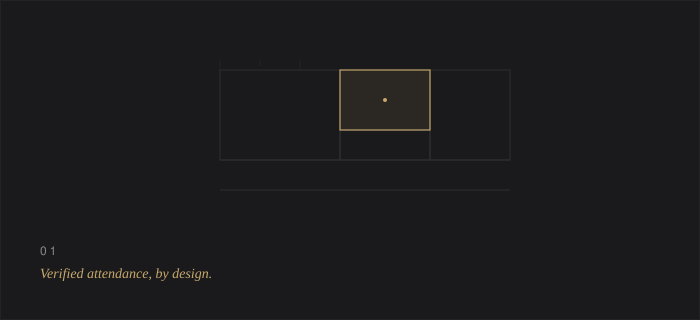
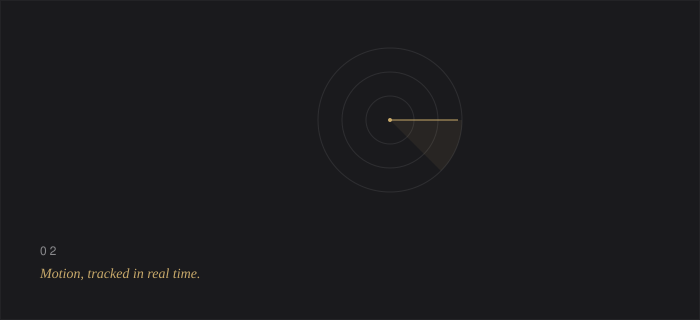
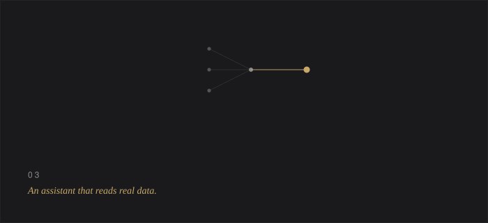

<!--
  Prince Naruka — profile.
  Repository: princeji2/princeji2
  Structure: README.md + /assets (6 handcrafted SVGs, no external
  image dependencies). Commit both together, as-is, at the repo root.
-->
  

  

  

 

Software should do less, and do it precisely.
 
I build AI systems the same way — deliberately, end to end.

 

  

 

### Current Mission

Naruka AI Labs — a solo AI research studio — and a full-stack system
 
for verified event attendance at my college.

 

  

 

### Selected Projects

 

  

**College Council Event Management System**
 
Replaces WhatsApp threads and paper attendance with QR-verified check-ins.
 
Next.js 16 &nbsp;·&nbsp; Prisma &nbsp;·&nbsp; PostgreSQL
 
[Repository](https://github.com/princeji2/Event-Management)

  

  

**AEGIS NOCTURNE**
 
A radar system that tracks motion in real time, built on an ESP32 and a single LIDAR sensor.
 
ESP32 &nbsp;·&nbsp; Node.js &nbsp;·&nbsp; WebSockets
 
<!-- CONFIRM repository link -->
[Repository](https://github.com/princeji2/AEGIS-NOCTURNE)

  

  

**PRINCE.OS**
 
A personal operating layer, wired to an assistant that reads real data instead of a script.
 
React &nbsp;·&nbsp; AI Assistant
 
<!-- CONFIRM repository link -->
[Repository](https://github.com/princeji2/PRINCE.OS)

 

  

 

### Engineering Stack

 

CORE
 

  

ENVIRONMENT
 

  

<em>LangGraph &nbsp;·&nbsp; Langfuse &nbsp;·&nbsp; RAGAS &nbsp;·&nbsp; Model Context Protocol &nbsp;·&nbsp; Ollama</em>

 

  

 

### Now Exploring

NeetCode 150 &nbsp;·&nbsp; pgvector &nbsp;·&nbsp; LangGraph &nbsp;·&nbsp; MCP &nbsp;·&nbsp; Langfuse &nbsp;·&nbsp; RAGAS &nbsp;·&nbsp; CI/CD

 

  

 

### Timeline

**Now** — data structures, retrieval systems, agent evaluation.
 
**Next** — a production RAG pipeline, and agentic workflows with LangGraph and MCP.

 

  

 

### Contact

[LinkedIn](https://www.linkedin.com/in/prince-naruka-26581236b/) &nbsp;·&nbsp; [GitHub](https://github.com/princeji2) &nbsp;·&nbsp; [Email](mailto:2025pietcprince041@poornima.org)

 

  

